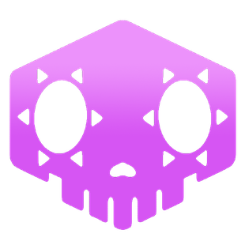

  

<h1 align="center">Sombra</h1>

  <strong>Overwatch Region Selector — Windows Desktop App</strong>

  
  
  
  

---

## What is Sombra?

**Sombra** is a lightweight desktop tool that lets you control which Overwatch servers you connect to by managing Windows Firewall rules at the network level. Select a region, block all others, and play on the server you actually want.

**Note**: This is not a VPN. It only works for Overwatch and only for the region you are trying to connect to. It does not work for any other game.

It works by blocking outbound **UDP** traffic to specific Google Cloud IP ranges used by Overwatch's game servers. TCP traffic (login, social, matchmaker) is always allowed, so your Battle.net client stays connected.

---

## Features

- 🌍 **Region Selection** — Block any combination of USA, South America, Europe, and Asia servers
- ⚡ **Auto-Optimize** — Pings all servers and automatically routes you to the lowest-latency region
- 📡 **Live Ping Monitor** — Background sweep updates server latency every 8 seconds
- 🎮 **Game Tracker** — Detects when Overwatch opens/closes and logs which server you are connected to
- 🚀 **Autostart** — Optional OS startup integration with three modes:
  - **Normal** — Opens the window as usual
  - **Minimized** — Starts minimized to the taskbar
  - **Tray Icon** — Starts hidden; double-click the tray icon to open
- 🔄 **Auto-Updater** — Checks GitHub Releases on launch and downloads updates with a visual progress bar
- 🖥️ **System Tray** — Right-click to show the app or quit; double-click to bring it to focus
- 🔒 **Admin-Aware** — All firewall operations require elevated privileges; the app warns you if it is not running as Administrator

---

## Requirements

| Requirement | Detail |
|---|---|
| OS | Windows 10 / 11 (64-bit) |
| Privileges | **Run as Administrator** (Required to create/modify Windows Firewall rules) |
| Game | Overwatch installed (auto-detected) |

---

## Installation

1. Go to the [**Releases**](https://github.com/jmaxdev/sombra/releases) page
2. Download the latest `.msi` installer
3. Run the installer

> Sombra must be run as Administrator to manage Windows Firewall rules. Without elevated privileges, the interface will load but all firewall changes will be blocked.

---

## How It Works

Overwatch uses **UDP** for all in-game traffic to its Google Cloud servers. Sombra creates Windows Firewall rules that block outbound UDP packets to the IP ranges of the regions you want to exclude. This forces the matchmaker to only consider servers in unblocked regions.

Authentication, social features, and the matchmaker queue all use **TCP** — those are never affected, so you can always log in and queue normally.

## Q&A

### Can be banned if i use sombra?

No, but if your ms / latency is not good probably you will be baned for disconections.

### Can i play with my friends?

Yes, but your friends need Sombra and mark the same servers.

### Sombra modify the game?

No. Sombra only change firewall settings in your computer.

---

## Usage

### Manual Mode
Toggle individual servers on or off using the lock icons on each server card. Changes apply instantly via the Windows Firewall API.

### Auto Mode
Click **FIND BEST SERVER** to ping all regions simultaneously. Sombra measures round-trip times and automatically blocks every region except the one with the lowest latency.

### Settings (⚙️)
Click the gear icon in the title bar to open the settings panel:
- Enable/disable **autostart on system boot**
- Choose your preferred **startup mode** (Normal, Minimized, or Tray Icon)

### System Tray
When running, Sombra places an icon in the system tray. Right-click for a menu to show the window or quit the app. Double-click to bring the main window to focus.

---

## Tech Stack

| Layer | Technology |
|---|---|
| Frontend | React 18 + TypeScript + Vite |
| Styling | Tailwind CSS |
| Icons | Lucide React |
| Desktop Shell | Tauri v2 |
| Backend | Rust |
| Firewall | Windows Filtering Platform (WFP) via COM |
| Ping | Raw ICMP sockets |
| Process Detection | Win32 ToolHelp32 API |
| Network Mapping | IP Helper API (`GetExtendedTcpTable`) |

---

## Disclaimer

Overwatch is a registered trademark of Blizzard Entertainment.
This application is a personal project and is not affiliated with, endorsed, sponsored, or specifically approved by Blizzard Entertainment.

Overwatch may have terms of service that prohibit the use of third-party tools. Users are responsible for complying with Blizzard Entertainment's policies.

---

## License

This project is for personal use. All rights reserved.

Overwatch is a trademark of Blizzard Entertainment. Sombra App is not affiliated with or endorsed by Blizzard Entertainment.

